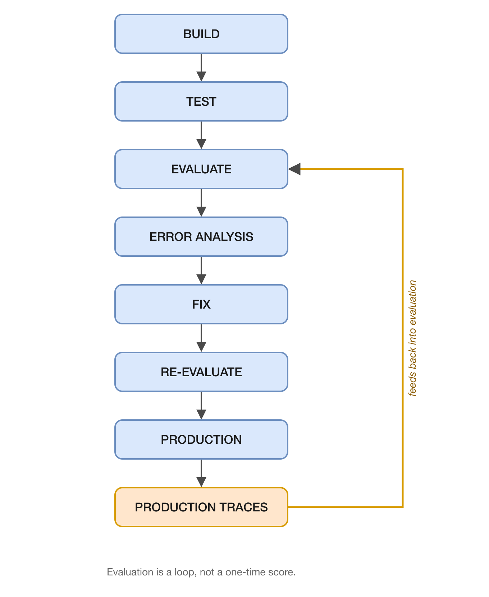
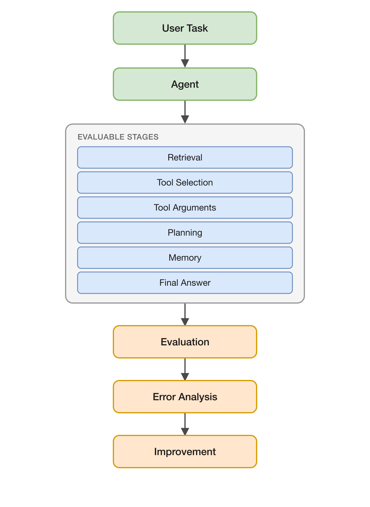

# Agentic Evals

Practical evaluation techniques, benchmarks, and examples for production AI agents.

Evaluate:

- RAG
- Tool Calling
- Planning
- Memory
- Safety
- Reliability
- Cost
- Latency

Building an AI agent is relatively easy. Knowing whether it is reliable enough for production is much harder.

This repository focuses on evaluating not just an agent's final answers, but — over time — the behavior and trajectory an agent takes to get there: what it retrieves, which tools it calls, how it plans, and what it remembers.

---

## Why Agent Evaluation?

Most teams can get a demo agent working in an afternoon. Very few can confidently answer:

- Does it pick the right tool, with the right arguments, every time?
- Does it retrieve the right context, and does it actually use it correctly?
- Does it recover when a tool call fails, or does it silently give up (or hallucinate)?
- Is it consistent, or does behavior drift across runs?
- What does it cost, and how fast is it, at the reliability bar you need?

Agentic Evals exists to make these questions answerable with concrete, reproducible experiments instead of vibes.

## What This Repository Covers

Currently, the repository includes hands-on evaluation notebooks for:

| Area | Notebook | What it evaluates |
|---|---|---|
| Prompt Evaluation | [`prompt_evals_v2.ipynb`](prompt_evals_v2.ipynb) | How different system prompts affect response accuracy, clarity, and completeness |
| Tool Calling | [`tool_eval_v2.ipynb`](tool_eval_v2.ipynb) | Tool selection precision/recall, tool success rate, and cost per successful task |
| RAG | [`rag_evals_v1.ipynb`](rag_evals_v1.ipynb) | Context relevance, answer groundedness, and answer correctness across retrieval configs |
| Planning & Reasoning | [`planning_evals.ipynb`](planning_evals.ipynb) | Direct vs. ReAct reasoning: correctness, reasoning quality, and tool-use appropriateness |
| Synthetic Data Generation | [`synthetic_data_gen.ipynb`](synthetic_data_gen.ipynb) | Dimension-based generation of diverse, non-repetitive evaluation datasets |
| Error Analysis | [`error_analysis_v1.ipynb`](error_analysis_v1.ipynb) | Systematic failure taxonomy and evidence-based prompt improvement |

Each notebook is self-contained, Google Colab-ready, and includes the metrics, dataset, and methodology used.

## Evaluation Architecture

The core philosophy: evaluation isn't a single score, it's a loop that feeds back into the agent.



> Agent evaluation should not end with a score. Evaluation should help identify failure modes, improve the agent, and continuously feed production failures back into the evaluation dataset.

Within a single evaluation run, an agent's behavior is broken down into evaluable stages:



## Quick Start

```bash
git clone https://github.com/abhineer/Agentic_Evals.git
cd Agentic_Evals
```

Each notebook is designed to run in Google Colab with no local setup:

1. Open any notebook (e.g. `tool_eval_v2.ipynb`) in Google Colab
2. Run the setup cell to install dependencies
3. Enter your [GROQ API key](https://console.groq.com) when prompted
4. Run all cells to see the evaluation results

To run locally, install the dependencies used across the notebooks:

```bash
pip install groq langchain langchain-groq pandas matplotlib
```

Requirements: Python 3.8+ and a GROQ API key.

## Examples

Start with:

- [`tool_eval_v2.ipynb`](tool_eval_v2.ipynb) — the most complete example, covering tool selection precision/recall, success rate, and cost-per-task on 6 tools across single-tool, multi-tool, ambiguous, and no-tool scenarios.
- [`error_analysis_v1.ipynb`](error_analysis_v1.ipynb) — shows the full loop from baseline agent → collected failures → failure taxonomy → targeted prompt fix → re-evaluation.

## Benchmarks

A dedicated, reproducible **Tool Use Benchmark** is in progress (see [Roadmap](#roadmap)). The goal is a fixed set of tasks — covering single-tool, multi-tool, no-tool, wrong-tool, and failure-recovery scenarios — that any agent can be run against and compared.

## Who Is This For?

- ML/AI engineers building agents who need to know if they're production-ready
- Teams evaluating tool use, RAG, planning, or memory in their own agents
- Practitioners who want reproducible evaluation methodology, not just a leaderboard

## Roadmap

**Current:** prompt, RAG, tool, and planning evaluation; synthetic evaluation data generation; error analysis.

**Coming next:** a Tool Calling Benchmark, agent trajectory evaluation, and a failure taxonomy for agents.

See [`ROADMAP.md`](ROADMAP.md) for the full plan.

## Contributing

Contributions are welcome — new evaluation techniques, benchmark tasks, datasets, metrics, error-analysis examples, and real-world agent evaluation write-ups are all useful. See [`CONTRIBUTING.md`](CONTRIBUTING.md) for details.

## License

MIT
